<!--
  KEEP THIS DIAGRAM IN SYNC WITH THE ACTUAL USER FLOW.
  Whenever the user flow changes — a new prompt, a changed option label, a new
  decision based on file/commit status, a new Ctrl-G command, a changed exit or
  update path — update the matching graph below in the same change. AGENTS.md
  records this as a standing requirement.
-->

# aGiTrack User Flow

A complete map of what aGiTrack shows the user, **when**, and what each choice does —
including which file/commit status triggers which prompt and where every nested option
leads. Read it top to bottom: start at [Lifecycle](#1-lifecycle-overview), then drill
into whichever phase you care about.

> This document is the source of truth for the interactive flow. If you change the flow,
> change the diagram (see the note at the top of the file).

**Legend**

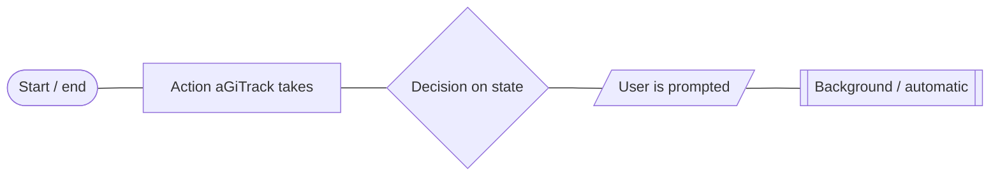

- `([ ])` start/end · `[ ]` an action · `{ }` a decision on repo/commit/session state ·
  `[/ /]` a prompt shown to the user · `[[ ]]` background/automatic work, no prompt.
- Edge labels are the user's answer, or the condition that selects that branch.

---

## 1. Lifecycle overview

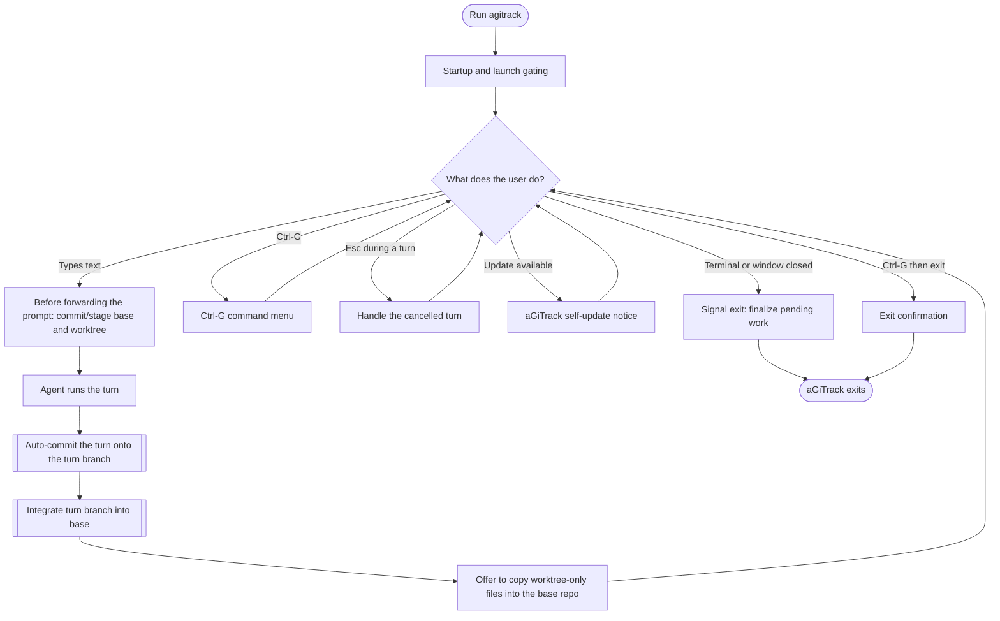

---

## 2. Startup and launch gating

Everything that must resolve before the backend TUI appears.

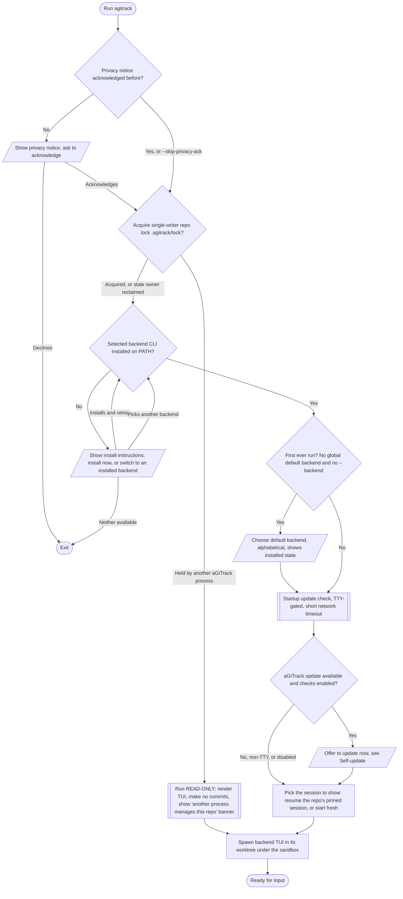

---

## 3. Worktrees vs no-worktree

Where a session physically runs (`--no-worktree` turns worktrees off) — this decides whether the base-to-worktree and
worktree-to-base flows below apply at all.

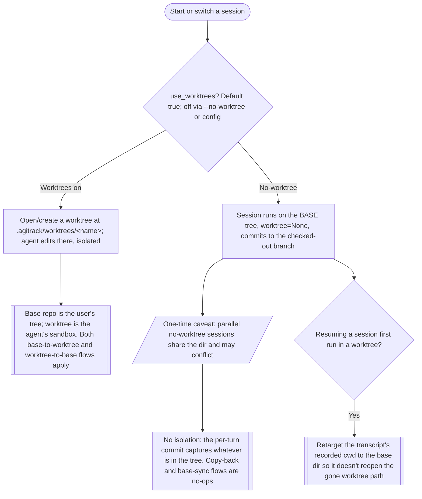

---

## 4. Before forwarding a prompt (base to worktree)

Runs every time the user submits text, **before** the backend sees it
(`_pre_agent_commit_if_needed`). The point: capture the user's own edits as a user
commit and make sure the agent starts from them. Driven by where uncommitted work lives.

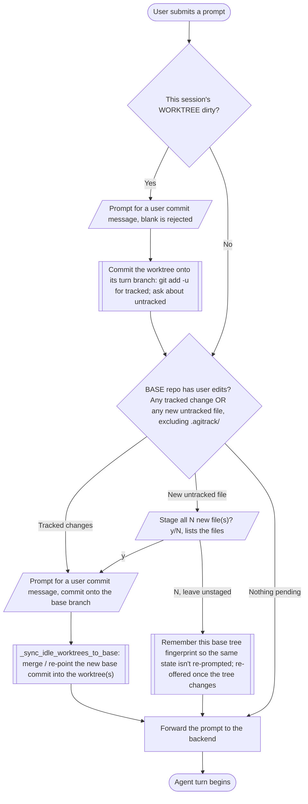

> The explicit base commit paths (this pre-prompt offer and the `git-user-commit`
> command) re-offer **every** untracked file (`include_declined=True`), so a previously
> declined file can always be staged here. The automatic worktree capture keeps the
> agent's own untracked decline sticky.

---

## 5. The agent turn: auto-commit and integration

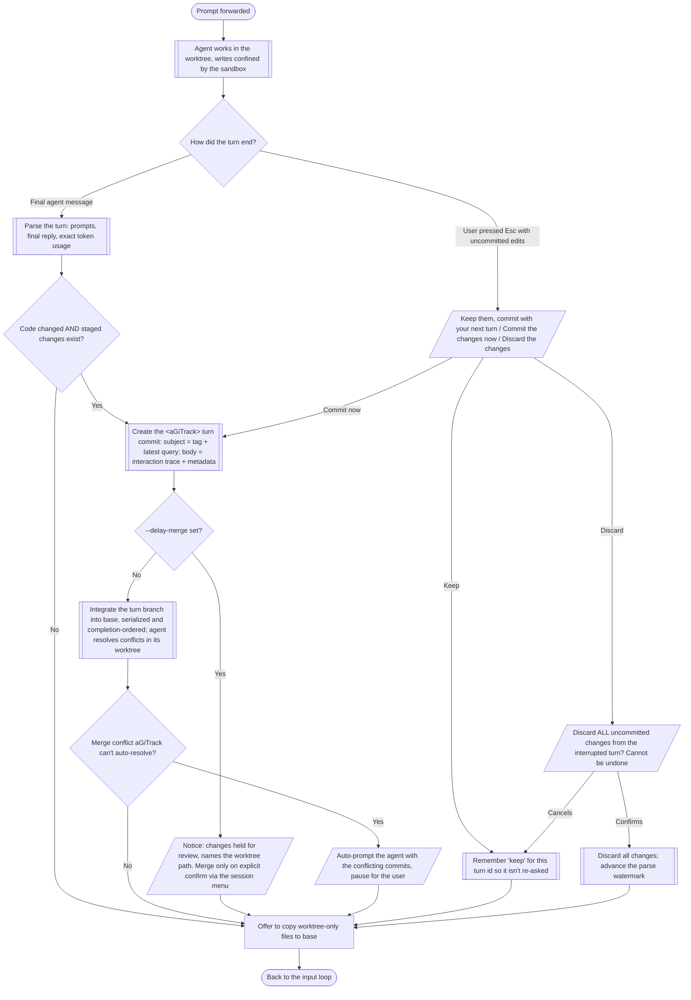

---

## 6. After the turn: copy worktree-only files to base

Only for a worktree session. Catches files the agent left UNCOMMITTED or that are
git-ignored — they integrate into nothing, so the user working in the base dir would
never see them (`_offer_copy_unstaged_to_base`). It runs for the **active** session only
(a background session is never interrupted mid-run); its files are caught instead when you
**switch to it** or on **aGiTrack exit**, just before the worktree is deleted.

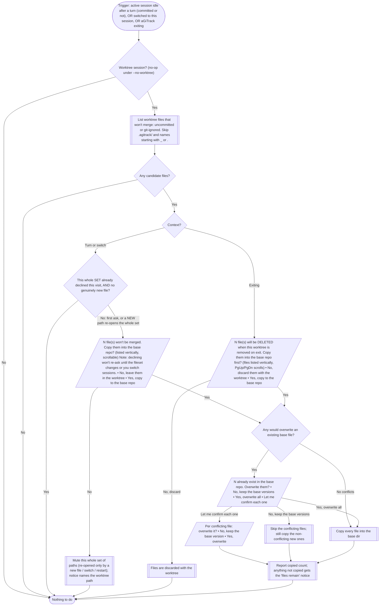

> A file already accepted or left in place isn't re-offered until its content changes
> (fingerprint). Declining mutes the whole current **set of paths** — aGiTrack won't ask
> again while only those files keep changing; a genuinely new path re-opens the whole set
> (ask about all again). The mute clears on session switch and aGiTrack restart. The
> **exit** offer ignores the mute (the files are about to be deleted) and warns as much.

---

## 7. Ctrl-G command menu

`Ctrl-G` opens the command palette (type a prefix, Up/Down to select, Tab to complete,
Enter to run). Commands, in palette order:

```mermaid
flowchart TD
  g(["Ctrl-G"]) --> pal[/"Command palette"/]
  pal --> sessions["sessions"]
  pal --> backend["agent-backend"]
  pal --> summ["summarizer"]
  pal --> gunstaged["git-unstaged"]
  pal --> gcommit["git-user-commit"]
  pal --> dash["dashboard"]
  pal --> update["update"]
  pal --> exit["exit"]

  sessions --> smenu[/"Sessions menu (live sessions show running/idle; dormant worktrees and shared markers listed too)"/]
  smenu -->|Switch to a live session| sswitch[["Show it, relaunch TUI, re-baseline so history isn't re-committed; then offer to copy its worktree-only files"]]
  smenu -->|Resume an idle/dormant worktree| sresume[["Reopen that session in its worktree; continue the backend conversation if still recorded"]]
  smenu -->|Resolve an unmerged dormant worktree| sresolve[/"Integrate its pending commits, or discard the worktree (confirmed)"/]
  smenu -->|+ New session| snew["Start a new session: own worktree, or shared base dir under --no-worktree"]
  smenu -->|✎ Rename a session| srename[["Rename = fork: clears the shared lineage, so a later share creates a NEW shared entry"]]
  smenu -->|⤳ Change a session's merge branch| smb[/"Pick the branch this idle session integrates into (flushes its pending work into the old branch first)"/]
  smenu -->|↻ Resume a past conversation| spast[/"Pick from past conversations of this repo, newest first"/]
  smenu -->|⇪ Share this session with collaborators| sshare["Session sharing"]
  smenu -->|⇩ Resume a shared session| srshare["Session sharing"]
  smenu -->|⚙ Manage shared sessions| smanage["Session sharing"]
  smenu -->|✓ Integrate this session's commits / Merge reviewed changes| smerge[/"Integrate this session's committed work into its base branch (pick the branch under --delay-merge)"/]
  smenu -->|- Stop a session| sstop[["Stop the session"]]
  snew --> mode3["See Worktrees vs no-worktree"]
  sswitch --> scopy["See After the turn: copy worktree-only files"]

  backend -->|No arg, picker| bpick[/"Pick claude or opencode"/]
  bpick --> bswitch[["Save current backend's session, relaunch target backend, restore its last session, update global default"]]

  summ --> spick[/"Pick the summarizer model, current shown"/]

  gunstaged --> gu[["Show intentionally-unstaged files in the status bar"]]

  gcommit --> gcflow["git-user-commit flow"]

  dash --> dserve[["Serve the read-only metrics dashboard; open the local browser only if it lands on this machine, else print the URL"]]

  update --> uflow["aGiTrack self-update flow"]

  exit --> exflow["Exit confirmation"]

  click snew "#3-worktrees-vs-no-worktree"
  click gcflow "#8-git-user-commit"
  click uflow "#9-self-update-flow"
  click exflow "#10-exit-and-terminal-close"
  click mode3 "#3-worktrees-vs-no-worktree"
  click sshare "#11-session-sharing"
  click srshare "#11-session-sharing"
  click smanage "#11-session-sharing"
  click scopy "#6-after-the-turn-copy-worktree-only-files-to-base"
```

---

## 8. `git-user-commit`

Creates a user commit (no `<aGiTrack>` tag) from the user's own edits, from whichever
tree holds them — the base repo and/or this session's worktree.

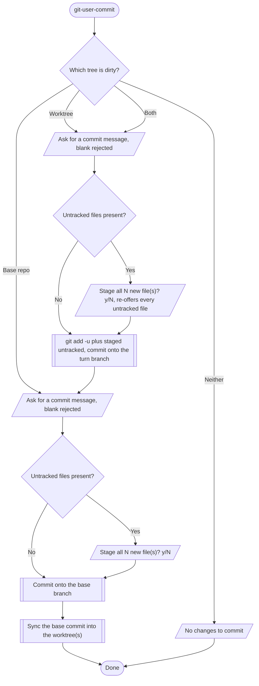

---

## 9. Self-update flow

aGiTrack updating **itself** (not the backend agent). Checked at startup and every
`update_check_seconds` (default 300s) on a worker thread.

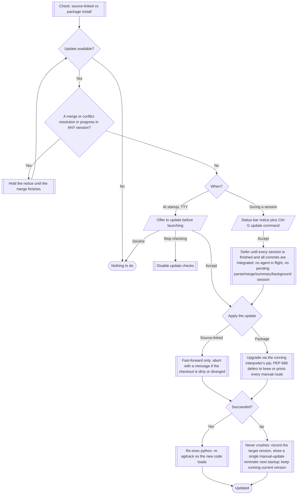

> Distinct from the **backend agent** (Claude / OpenCode) updating itself: that runs
> inside the agent TUI, and the sandbox is built to keep the agent's own install dirs
> writable so it always works. See `agitrack/proxy/sandbox.py`.

---

## 10. Exit and terminal close

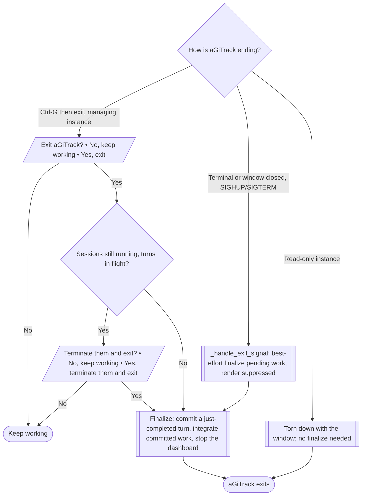

---

## 11. Session sharing

Sharing pushes a session's **redacted** backend transcript to `origin` on a custom ref
(`refs/agitrack/shared-sessions`), keyed by repo + your GitHub id + a name, so collaborators
on the same repo can resume your conversation. Opt-in, with informed consent on every share
(`_share_session`, `_resume_shared_session_menu`, `_manage_shared_sessions_menu`). Only
backends with a portable transcript (Claude) support it.

### Share this session

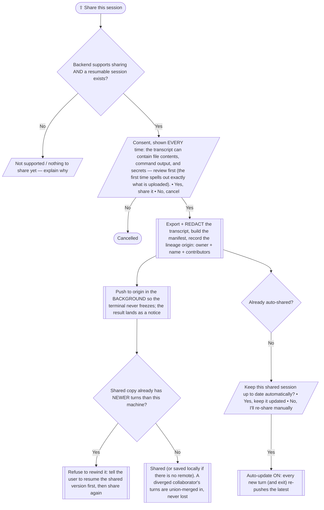

### Resume a shared session

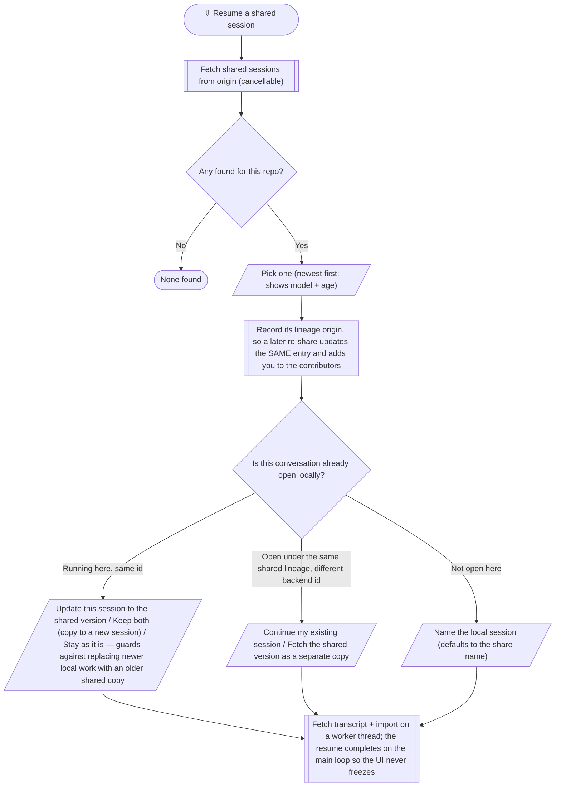

### Manage / unshare

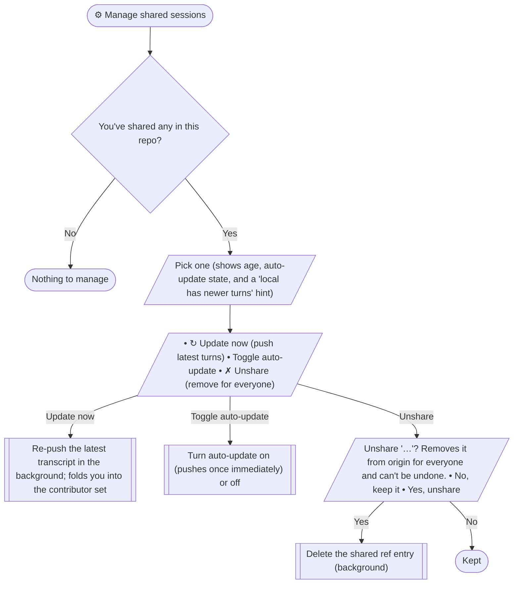

> Renaming a session **forks** it (`_fork_lineage_on_rename`): the shared lineage origin is
> cleared, so sharing the renamed session creates a NEW `<you>/<new-name>` shared entry rather
> than updating the one it came from. The whole feature is opt-in; nothing is uploaded without
> an explicit "Yes" each time.

---

### Cross-references

- Prose spec: [`AGENTS.md`](../AGENTS.md) — Staging Behavior, Concurrent Sessions, Session Sharing, Self-Update, Concurrency and Locking.
- User-facing docs: [`README.md`](../README.md) — including [Sharing sessions](../README.md#sharing-sessions).
- Sandbox / confinement: `agitrack/proxy/sandbox.py`; per-turn commit and copy logic: `agitrack/proxy/runner.py`; sharing store: `agitrack/sessions/store.py`.
