<!--
  KEEP THIS DIAGRAM IN SYNC WITH THE ACTUAL USER FLOW.
  Whenever the user flow changes — a new prompt, a changed option label, a new
  decision based on file/commit status, a new Ctrl-G command, a changed exit or
  update path — update the matching graph below in the same change. AGENTS.md
  records this as a standing requirement.
-->

# aGiTrack User Flow

A complete map of what aGiTrack shows the user, **when**, and what each choice does —
including which file/commit status triggers which prompt and where every nested option
leads. Read it top to bottom: start at [Lifecycle](#1-lifecycle-overview), then drill
into whichever phase you care about.

> This document is the source of truth for the interactive flow. If you change the flow,
> change the diagram (see the note at the top of the file).

**Legend**

- `([ ])` start/end · `[ ]` an action · `{ }` a decision on repo/commit/session state ·
  `[/ /]` a prompt shown to the user · `[[ ]]` background/automatic work, no prompt.
- Edge labels are the user's answer, or the condition that selects that branch.

---

## 1. Lifecycle overview

**Jump to:** [Startup and launch gating](#2-startup-and-launch-gating) ·
[Worktrees vs no-worktree](#3-worktrees-vs-no-worktree) ·
[Manual-commit mode](#3a-manual-commit-mode---manual-commits---m) ·
[Before forwarding a prompt](#4-before-forwarding-a-prompt-base-to-worktree) ·
[The agent turn](#5-the-agent-turn-auto-commit-and-integration) ·
[Copy worktree-only files](#6-after-the-turn-copy-worktree-only-files-to-base) ·
[Ctrl-G command menu](#7-ctrl-g-command-menu) ·
[Self-update flow](#9-self-update-flow) ·
[Exit and terminal close](#10-exit-and-terminal-close)

> Under **`--manual-commits` / `-m`** the auto-commit → integrate steps above are replaced: each turn
> is recorded as a hidden latent commit and the branch is only ever written by **your** commit, which
> folds the pending turns in. See [Manual-commit mode](#3a-manual-commit-mode---manual-commits---m).

---

## 2. Startup and launch gating

Everything that must resolve before the backend TUI appears.

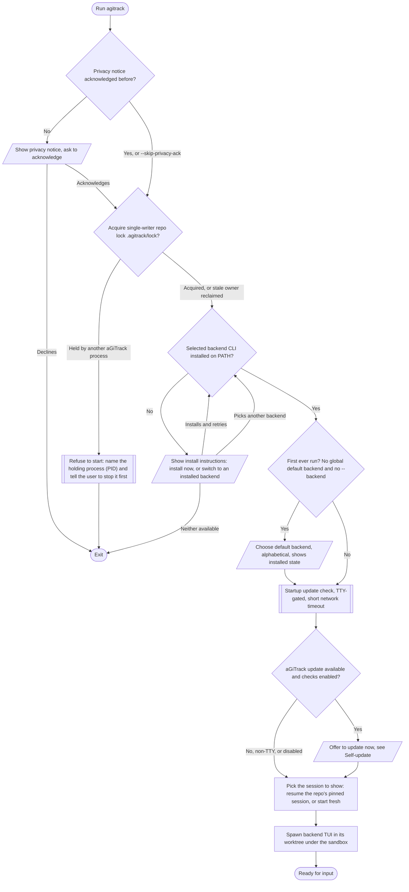

**Jump to:** [Self-update flow](#9-self-update-flow) ·
[Worktrees vs no-worktree](#3-worktrees-vs-no-worktree)

---

## 3. Worktrees vs no-worktree

Where a session physically runs (`--no-worktree` turns worktrees off) — this decides whether the base-to-worktree and
worktree-to-base flows below apply at all. `--manual-commits` / `-m` is a **commit-timing variant of no-worktree**: it
**always runs without a worktree** (it implies `--no-worktree`) and additionally defers every commit to the user (see [Manual-commit mode](#3a-manual-commit-mode---manual-commits---m)).

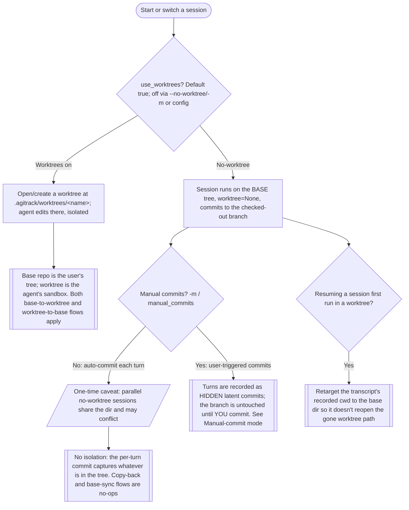

**Jump to:** [Manual-commit mode](#3a-manual-commit-mode---manual-commits---m)

---

## 3a. Manual-commit mode (`--manual-commits` / `-m`)

Makes agent-assisted coding feel like normal git: **you** decide when to commit. It **always runs
without a worktree** (it implies `--no-worktree`, so the agent edits the current branch directly),
but aGiTrack does **not** create a commit each turn. Instead every turn is recorded as a hidden **latent** commit on a side ref
(`refs/agitrack/manual/<session>`) that your branch never shows, while `HEAD` stays put — so your
history stays clean while you work, and no interaction is lost.

When **you** commit — through `Ctrl-G → git-commit` **or** an ordinary `git commit` on the command
line / in your editor — aGiTrack folds every pending latent turn's interaction trace and metadata
into that **one** commit, alongside your own edits. A managed `prepare-commit-msg` hook does the
folding and a `post-commit` hook resets the latent ref; both are installed only for the manual-mode
session and removed on exit. So you always get a single, self-contained commit carrying your changes
**and** the full agent tracking — whether or not the commit went through aGiTrack's menu, with no
separate cover commit and no `<aGiTrack>` commits polluting the branch. Enable it for every run with
`"manual_commits": true` in config.

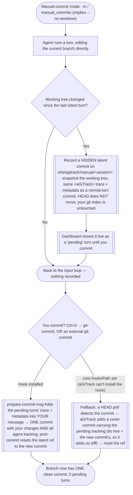

> The single folded commit carries a `commit_type: user` block plus one block per agent turn, so the
> dashboard parses it as a squash — summing the turns' tokens and classifying it as agent-tracked
> work. A commit made with **no** pending turns is still a plain, session-attributed user commit.
> Recovery: if a prior run left the latent ref already contained in `HEAD` (an interrupted commit),
> the next start resets it so those turns are never re-folded.

**Jump to:** [`git-commit`](#8-git-commit) · [The agent turn](#5-the-agent-turn-auto-commit-and-integration)

---

## 3b. Background mode (`--background` / `-b`)

Runs aGiTrack **without the interactive TUI** so you can drive the coding agent from **any** UI (the
**Claude desktop app**, an IDE extension, its native CLI, a chat window) while aGiTrack tracks that
session in the background — the interactive-UI-agnostic tracker of
[issue #143](https://github.com/core-aix/agitrack/issues/143). Especially handy if you'd rather stay
in a GUI than a terminal. aGiTrack does **not** launch or relay the agent; it watches the agent's
on-disk session transcript for the repo (**only** this repo's — Claude by its cwd-encoded transcript
dir, OpenCode by each session's recorded directory), records each completed turn, summarizes it, and
installs the fold hooks. It **always runs without a worktree** (implies `--no-worktree`), with either
commit style (auto — default — or `--manual-commits`).

**It runs as a DETACHED daemon, like `agitrack -d`.** `agitrack -b` starts the tracker in the
background and **returns to your shell immediately**; unlike the dashboard daemon it has **no
owner-terminal watchdog**, so it keeps tracking after the terminal closes — stop it with
`agitrack -b stop`. `agitrack -b status` reports whether one is running; **`agitrack --status` / `-s`**
reports the mode of whatever is tracking the repo (interactive vs background, auto/manual,
worktree/no-worktree, or not running) and whether **auto-start on commit** is enabled. The daemon
logs activity to `<repo>/.agitrack/background.log`, appends notable events to a user `--log-file`,
and reminds you (never auto-installs) when an aGiTrack update is available. Auto commits are **clean
agent commits** (subject = the LLM summary, one metadata block); the daemon waits briefly for the
summary before folding since it never amends HEAD. Only one aGiTrack runs per repo (the shared repo
lock refuses a second start).

**Never forget to start it — auto-start on commit.** aGiTrack installs a PERSISTENT `pre-commit`
hook (surviving the daemon exiting). When you `git commit` while no tracker is running and the AI
actually changed code, the hook folds that AI work's trace into your (own, manual) commit AND
**auto-starts** the daemon for the turns that follow — in the **same commit mode as your last run** —
printing an explicit "started automatically … stop with `agitrack -b stop`; disable with
`agitrack --remove-hooks`" message. A purely human commit is left untouched. The first `agitrack -b`
per repo asks whether to enable this (default on; repo-scoped `autotrack_hook`); `agitrack --remove-hooks`
turns it off. The hook calls the CURRENT aGiTrack even after a self-update (frozen-aware invocation +
PATH fallback).

**Keeping the hook's schema current.** Every background start (when `autotrack_hook` isn't `off`)
re-installs this hook and **stamps the running aGiTrack version** into it (a
`# AGITRACK-AUTOTRACK-VERSION <version>` line). Before writing, it compares the version stamped in the
already-installed hook against the running one: if the installed hook is **older** (or predates version
stamping and carries no stamp), aGiTrack **removes the previously installed hook** — restoring any
project hook it had chained — and then **installs the current version fresh**, so a changed hook schema
is never left half-migrated. A same-or-newer stamp just refreshes the baked invocation in place. This
runs on the background startup path (and equally when a no-worktree interactive session installs the same
persistent hook).

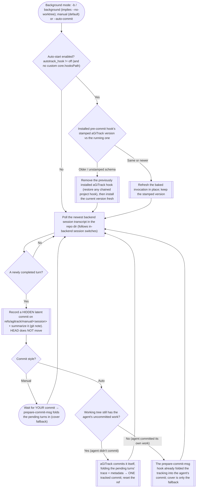

The per-conversation commit watermark makes this exact even when you switch conversations inside the
backend (a `/resume` or a new conversation, tested on both backends): aGiTrack follows the newest
session and counts each conversation's turns exactly once, and sub-agent tokens are folded into the
launching turn. `agitrack -b stop` records any final turn (folding it in auto mode) and removes its
per-run fold hooks (the persistent auto-track `pre-commit` hook stays, so a later commit still tracks).

**Jump to:** [Manual-commit mode](#3a-manual-commit-mode---manual-commits---m) · [The agent turn](#5-the-agent-turn-auto-commit-and-integration)

---

## 4. Before forwarding a prompt (base to worktree)

Runs every time the user submits text, **before** the backend sees it
(`_pre_agent_commit_if_needed`). The point: capture the user's own edits as a user
commit and make sure the agent starts from them. Driven by where uncommitted work lives.

**Jump to:** [The agent turn](#5-the-agent-turn-auto-commit-and-integration)

> The explicit base commit paths (this pre-prompt offer and the `git-commit`
> command) re-offer **every** untracked file (`include_declined=True`), so a previously
> declined file can always be staged here. The automatic worktree capture keeps the
> agent's own untracked decline sticky.

---

## 5. The agent turn: auto-commit and integration

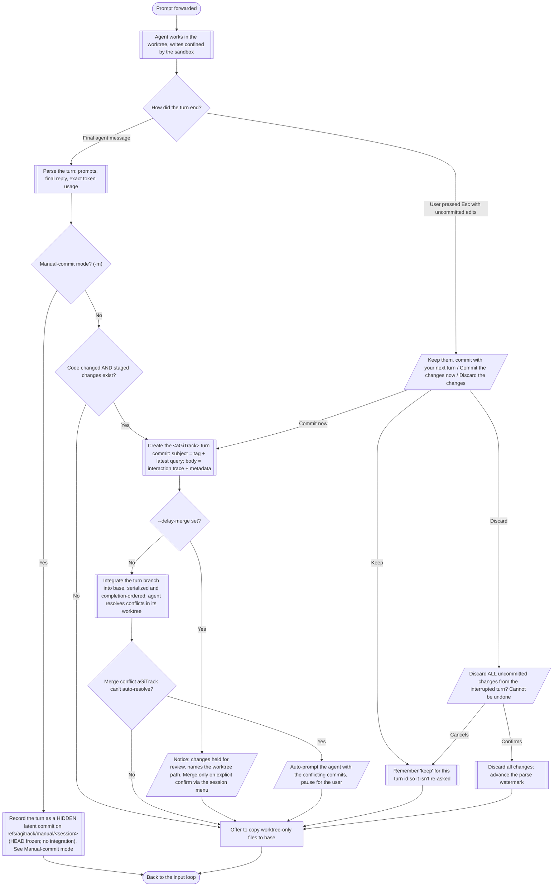

> **The whole status → commit → integrate pipeline above runs on a dedicated git worker
> thread, never the main one** — so a `git status`/commit/merge can never block your typing,
> even right after an edit. Any dialog it needs (the conflict prompt, the copy/keep/discard
> offers) is handed to the main thread to present and the answer passed back; the worker only
> ever touches the **foreground** session. Background sessions are committed/integrated on the
> main thread (rare, throttled, and never the session you're typing in).

**Jump to:** [Copy worktree-only files to base](#6-after-the-turn-copy-worktree-only-files-to-base)

---

## 6. After the turn: copy worktree-only files to base

Only for a worktree session. Catches files the agent left UNCOMMITTED or that are
git-ignored — they integrate into nothing, so the user working in the base dir would
never see them (`_offer_copy_unstaged_to_base`). It runs for the **active** session only
(a background session is never interrupted mid-run); its files are caught instead when you
**switch to it** or on **aGiTrack exit**, just before the worktree is deleted.

First, though, aGiTrack offers to **commit** any of the user's own uncommitted edits in
the worktree (`_offer_user_commit_for_worktree_edits`) — those belong in git, not just
copied. So when both a user edit and copy-able leftovers exist, **both prompts appear**: a
commit prompt for the edits, then the copy prompt for the leftovers.

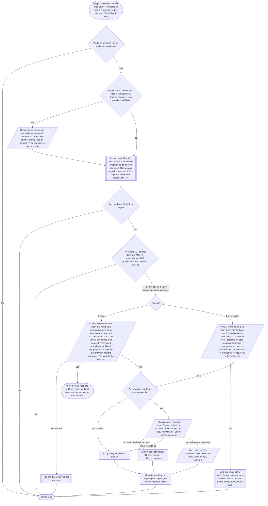

**Jump to:** [`git-commit`](#8-git-commit)

> A file already accepted or left in place isn't re-offered until its content changes
> (fingerprint). Declining mutes the whole current **set of paths** — aGiTrack won't ask
> again while only those files keep changing; a genuinely new path re-opens the whole set
> (ask about all again). The mute clears on session switch and aGiTrack restart. The
> **exit** offer ignores the mute (the files are about to be deleted) and warns as much.

---

## 7. Ctrl-G command menu

`Ctrl-G` opens the command palette (type a prefix, Up/Down to select, Tab to complete,
Enter to run). Commands, in palette order:

> **One rule across every menu: Esc goes up exactly one level.** The **command palette is
> the parent of every command menu**, so Esc on a command menu (the sessions list, the
> settings list, the summarizer menu…) returns you **to the palette** — not to the agent.
> Esc on the palette returns to the agent. Esc in a sub-menu returns to the menu that opened
> it (e.g. Esc in *Manage <one shared session>* → the shared-sessions list → the sessions
> menu → the palette → the agent — one step per Esc). The only thing that unwinds further is
> a choice that moves you into a **different session** (switch / new / resume): that drops
> straight to the agent, since there is no level to come back to.
>
> Navigation is **silent and instant**: backing out shows no "closed/cancelled" message and
> never flashes the bare backend screen between levels. Internally each menu is one loop
> returning just `UP` (Esc/back → caller re-shows itself) or `DONE` (a session transition →
> unwind to the agent); a child menu the user backs out of simply re-shows its parent. So Esc
> unwinds the call stack one frame at a time and the on-screen hierarchy mirrors the code's.

```mermaid
flowchart TD
  g(["Ctrl-G"]) --> pal[/"Command palette"/]
  pal --> sessions["sessions"]
  pal --> backend["agent-backend"]
  pal --> summ["summarizer"]
  pal --> settings2["settings"]
  pal --> gunstaged["git-unstaged"]
  pal --> gcommit["git-commit"]
  pal --> dash["dashboard"]
  pal --> update["update"]
  pal --> exit["exit aGiTrack"]

  settings2 --> setmenu["Settings menu"]

  sessions --> smenu[/"Sessions menu (live sessions show running/idle; dormant worktrees and shared markers listed too)"/]
  smenu -->|Switch to a live session| sswitch[["Show it, relaunch TUI, re-baseline so history isn't re-committed; then offer to copy its worktree-only files"]]
  smenu -->|Resume an idle/dormant worktree| sresume[["Reopen that session in its worktree; continue the backend conversation if still recorded"]]
  smenu -->|Resolve an unmerged dormant worktree| sresolve[/"Integrate its pending commits, or discard the worktree (confirmed)"/]
  smenu -->|+ New session| snew["Start a new session: own worktree, or shared base dir under --no-worktree"]
  smenu -->|✎ Rename a session| srename[["Rename = fork: clears the shared lineage, so a later share creates a NEW shared entry"]]
  smenu -->|⤳ Change a session's merge branch| smb[/"Pick the branch this idle session integrates into (flushes its pending work into the old branch first)"/]
  smenu -->|↻ Resume a past conversation| spast[/"Pick from past conversations of this repo, newest first"/]
  smenu -->|⇪ Share this session with collaborators| sshare["Session sharing"]
  smenu -->|⇩ Resume a shared session| srshare["Session sharing"]
  smenu -->|⚙ Manage shared sessions| smanage["Session sharing"]
  smenu -->|✓ Integrate this session's commits / Merge reviewed changes| smerge[/"Integrate this session's committed work into its base branch (pick the branch under --delay-merge)"/]
  smenu -->|- Stop a session| sstop[["Stop the session"]]
  snew --> mode3["See Worktrees vs no-worktree"]
  sswitch --> scopy["See After the turn: copy worktree-only files"]

  backend -->|No arg, picker| bpick[/"Pick claude or opencode"/]
  bpick --> bswitch[["Save current backend's session, relaunch target backend, restore its last session, update global default"]]

  summ --> smm[/"Summarizer menu: Toggle (ON/OFF) / Set model"/]
  smm -->|Toggle| stog[["Flip on/off; menu re-shows"]]
  smm -->|Set model| spick[/"Pick the summarizer model (current shown); Esc → back to the Summarizer menu"/]
  spick --> smm

  gunstaged --> gu[["Show intentionally-unstaged files in the status bar"]]

  gcommit --> gcflow["git-commit flow"]

  dash --> dserve[["Serve the read-only metrics dashboard; open the local browser only if it lands on this machine, else print the URL"]]

  update --> uflow["aGiTrack self-update flow"]

  exit --> exflow["Exit confirmation"]
```

**Jump to:** [Worktrees vs no-worktree](#3-worktrees-vs-no-worktree) ·
[Copy worktree-only files](#6-after-the-turn-copy-worktree-only-files-to-base) ·
[`git-commit`](#8-git-commit) ·
[Self-update flow](#9-self-update-flow) ·
[Exit and terminal close](#10-exit-and-terminal-close) ·
[Session sharing](#11-session-sharing) ·
[Settings menu](#12-settings-menu)

---

## 8. `git-commit`

Creates a user commit (no `<aGiTrack>` tag) from the user's own edits, from whichever
tree holds them — the base repo and/or this session's worktree.

> **Under `--manual-commits` / `-m` this command does more.** Manual mode always runs
> **no-worktree** (it implies `--no-worktree`), so there is only the base tree — and this same
> `git-commit` is the one command used for **both** a plain user commit and a commit that includes
> the agent's tracked work. It stages your changes, then folds every pending latent turn's trace +
> metadata into the message so the result is a **single** commit carrying your edits *and* the full
> agent tracking; the latent ref is then reset. (An external `git commit` you run yourself gets the
> same folding via the `prepare-commit-msg` hook.) See
> [Manual-commit mode](#3a-manual-commit-mode---manual-commits---m).

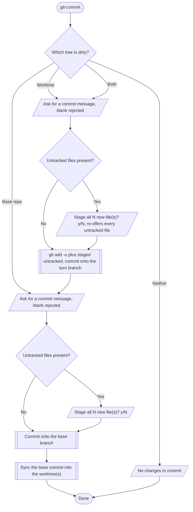

---

## 9. Self-update flow

aGiTrack updating **itself** (not the backend agent). Checked at startup and every
`update_check_seconds` (default 300s) on a worker thread.

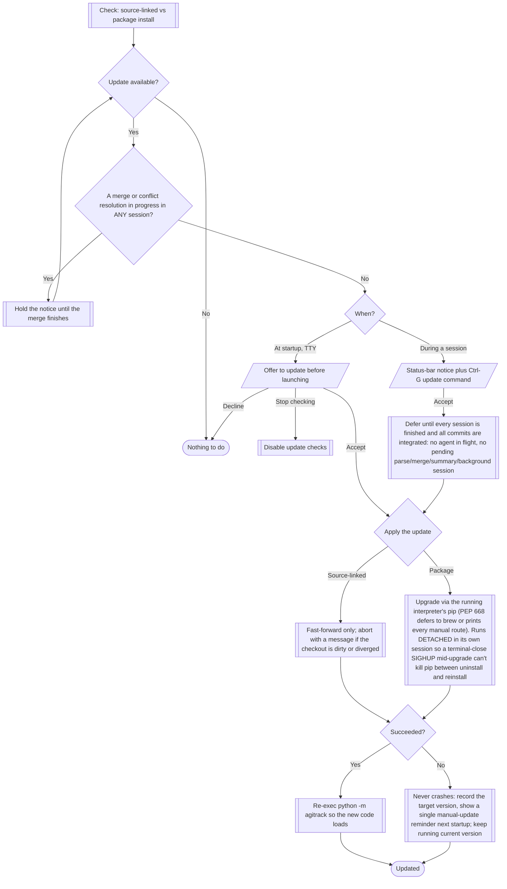

> **An interrupted upgrade never leaves aGiTrack uninstalled.** `pip install --upgrade`
> removes the old version before writing the new, so the upgrade runs in its own session
> (`start_new_session`) and a SIGHUP/SIGTERM that arrives while it applies is **ignored**
> (the apply + restart finish) — closing the terminal or quitting VS Code mid-upgrade can no
> longer strand the package half-removed.

> Distinct from the **backend agent** (Claude / OpenCode) updating itself: that runs
> inside the agent TUI, and the sandbox is built to keep the agent's own install dirs
> writable so it always works. See `agitrack/proxy/sandbox.py`.

---

## 10. Exit and terminal close

Exiting **always asks first** — a deliberate safety net — regardless of whether anything is
pending. Pressing **Esc** at any exit prompt **cancels the exit**: aGiTrack keeps running and
tells you what was *not* done, so you can handle it yourself (commits already made this exit
are kept; nothing is deleted). Only an explicit "Yes"/"No" choice proceeds.

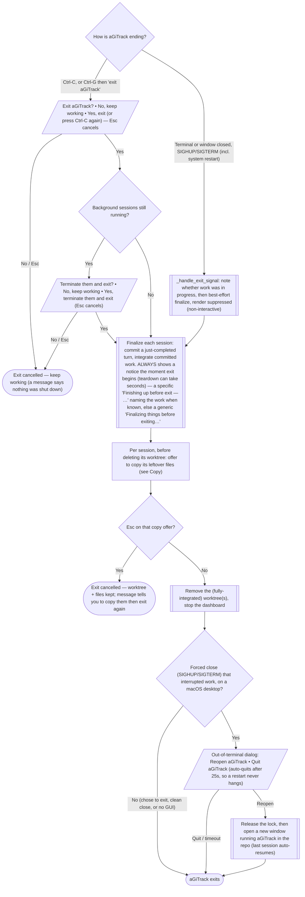

**Jump to:** [Copy worktree-only files to base](#6-after-the-turn-copy-worktree-only-files-to-base)

---

## 11. Session sharing

Sharing pushes a session's **redacted** backend transcript to `origin` on a custom ref
(`refs/agitrack/shared-sessions`), keyed by repo + your GitHub id + a name, so collaborators
on the same repo can resume your conversation. Opt-in, with consent on every share — the
first prompt spells out exactly what is uploaded (`_share_session`,
`_resume_shared_session_menu`, `_manage_shared_sessions_menu`). Only backends with a portable
transcript (Claude) support it.

### Share this session

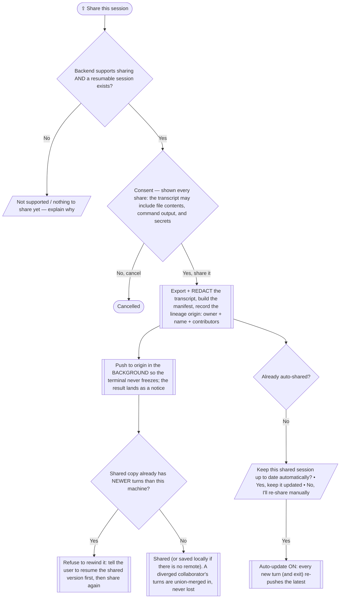

### Resume a shared session

### Manage / unshare

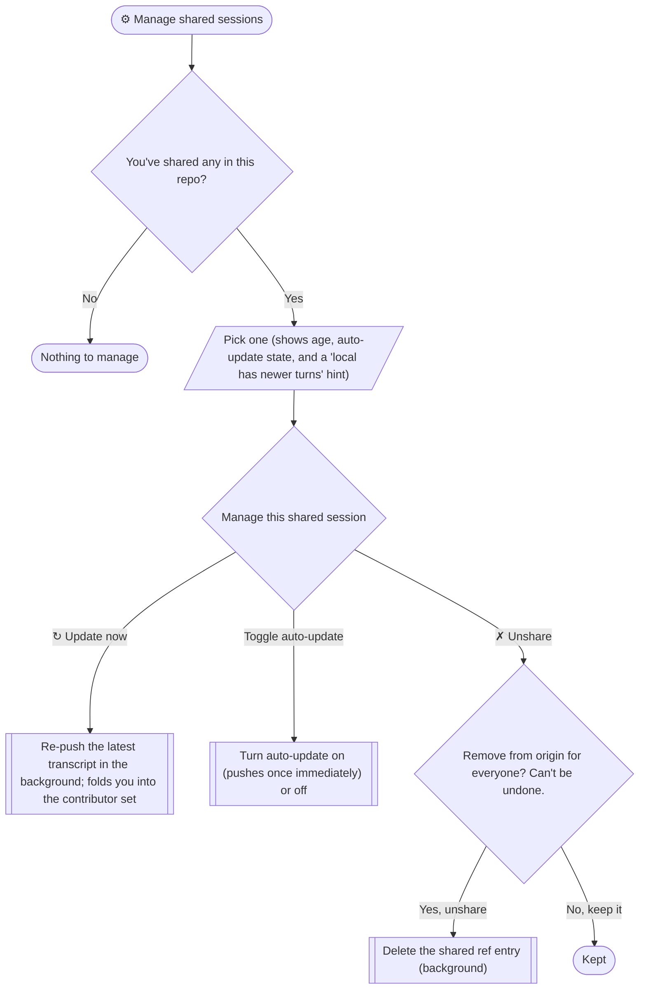

> Renaming a session **forks** it (`_fork_lineage_on_rename`): the shared lineage origin is
> cleared, so sharing the renamed session creates a NEW `<you>/<new-name>` shared entry rather
> than updating the one it came from. The whole feature is opt-in; nothing is uploaded without
> an explicit "Yes" each time.

---

## 12. Settings menu

`Ctrl-G → settings` opens an editor for **all** config options, each labelled in plain
language and showing its current effective value and source (`· repo` / `· global`, or
nothing for a built-in default). The menu is a small **form**: edits are collected as
**pending** changes — each one picks its own scope, **This repository**
(`<repo>/.agitrack/config.json`) or **Global** (`~/.agitrack/config.json`) — and is
written only when you **save on the way out**. A pending row shows its new value as
`· UNSAVED → repo/global`. Precedence: repo-local wins over global wins over the built-in
default (`GlobalConfig` overlay).

**Esc goes up one level**, everywhere ([§7](#7-ctrl-g-command-menu) describes the same rule
for every menu): Esc at a value editor → back to the list; Esc at the scope prompt → back to
the value editor; Esc on the list → close. **Closing with unsaved changes asks whether to
save them** — *Yes, save them / No, discard them / ← Keep editing* — so nothing is written
silently and nothing is lost without a prompt.

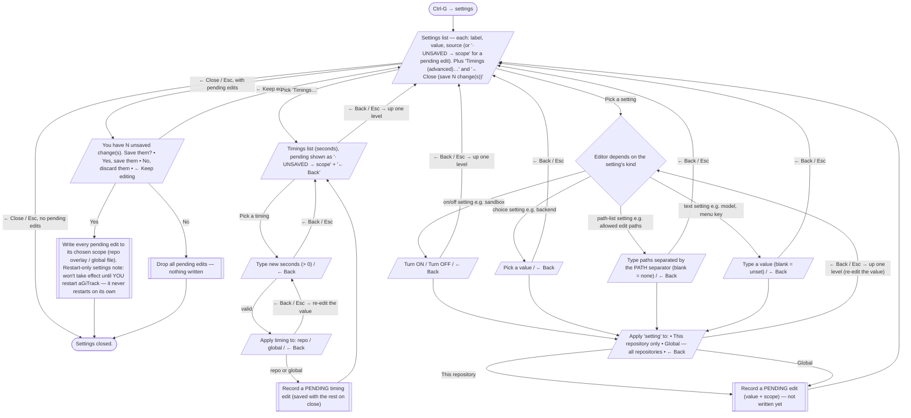

> **Sandbox & allowed edit paths.** By default the backend agent is confined (`sandbox`)
> so it can only write inside its session worktree (plus `.git`). `allowed_edit_paths`
> lists extra directories/files it may write to (e.g. a shared data dir). Both are settable
> here, in either config file, or per run on the command line: `--no-sandbox` and
> `--allowed-edit-paths <path>[:<path>…]` (`:`-separated like `PATH`; a CLI flag wins over
> config). On macOS the carve-out covers not-yet-created paths; under Linux bubblewrap a
> path under the read-only base must already exist to become writable.

---

## 13. Backtrace (`--backtrace`) — reconstruct a history you didn't track

Backtrace is **read-only reconstruction from local transcripts** — it works with no prior aGiTrack
use and even in a directory that was never a git repo. It answers "show me (and optionally commit)
what my past coding-agent sessions did here."

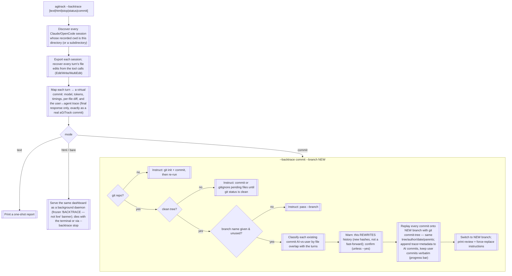

- **View** (`text` / `html` / bare): nothing is written and nothing is uploaded. The served view
  is built once and cached (re-exporting per poll would be far too slow). Committer chrome and the
  commit hash are hidden — a reconstructed turn has no committer and no real commit — and only the
  agent's **final response** is shown, matching what a real aGiTrack commit records.
- **`stop` / `status`**: manage the background daemon (per-directory handshake in a temp dir, so it
  works in non-git folders and never collides with the `-d` dashboard daemon).
- **`commit`**: the only writing path. It is deliberately gated — git repo required, clean tree
  required, a new branch required — and it never touches the current branch. AI-vs-user attribution
  is by file overlap: a commit whose changed files an agent turn edited is AI (annotated); a commit
  no turn explains is a user commit (kept verbatim). Because it rewrites history, aGiTrack prints
  the exact `git branch -f` / `git push --force-with-lease` steps and tells the user to review the
  new branch first.

Implementation: `agitrack/metrics/backtrace.py` (view + daemon), `agitrack/metrics/backtrace_commit.py`
(the `commit` replay), `agitrack/metrics/files.py` (file browser), `agitrack/transcripts/` (edit
recovery).

---

### Cross-references

- Prose spec: [`AGENTS.md`](../AGENTS.md) — Staging Behavior, Concurrent Sessions, Session Sharing, Self-Update, Concurrency and Locking.
- User-facing docs: [`README.md`](../README.md) — including [Sharing sessions](../README.md#sharing-sessions).
- Sandbox / confinement: `agitrack/proxy/sandbox.py`; per-turn commit and copy logic: `agitrack/proxy/runner.py`; sharing store: `agitrack/sessions/store.py`.
